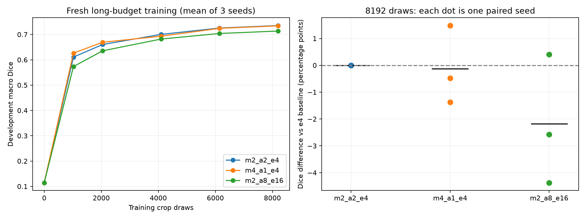

# 5080 补充试验结果

完成推理 batch 对照及 3 组 × 3 种子长预算训练。仍是 32 张训练图、8 张开发图的探索；未使用官方测试集。

## 同为 8192 样本的训练结果

| 布局 | 平均 Dice | 相对基准差/百分点 | 三个配对差/百分点 |
|---|---:|---:|---|
| m2_a2_e4 | 0.73534 | +0.000 | +0.000, +0.000, +0.000 |
| m4_a1_e4 | 0.73412 | -0.122 | +1.482, -1.371, -0.477 |
| m2_a8_e16 | 0.71356 | -2.178 | -2.570, +0.410, -4.372 |

## 同为 512 次参数更新的辅助对照

新 effective 16 使用 8192 样本；旧 effective 4 使用 2048 样本。初始化和逐更新学习率相同已核验，实际输入的共有前缀一致。样本暴露量不同，且实验先后执行，不是排除全部混杂的因果估计。

- 种子 2026：旧 e4=0.68267，新 e16=0.70124，差 +1.857 个百分点。
- 种子 2027：旧 e4=0.67428，新 e16=0.72483，差 +5.054 个百分点。
- 种子 2028：旧 e4=0.66597，新 e16=0.71461，差 +4.864 个百分点。

## 固定权重的推理 batch 对照

计时为预热后的单次描述性测量；三种子模型 × 八张图，不视为 24 个独立患者。以原 batch 4 为参照。

| batch | 总秒数 | 峰值显存/GiB | 平均 Dice 差/百分点 | 最大概率差 | 二值翻转比例 |
|---|---:|---:|---:|---:|---:|
| 1 | 12.49 | 0.26 | -0.000032 | 0.00112128 | 0.00006358% |
| 2 | 10.73 | 0.50 | +0.000056 | 0.00100073 | 0.00007053% |
| 4 | 9.77 | 0.96 | +0.000000 | 0.00000000 | 0.00000000% |
| 8 | 9.09 | 1.90 | -0.000179 | 0.00408810 | 0.00035663% |
| 16 | 8.74 | 3.77 | -0.000179 | 0.00408810 | 0.00035663% |

## 限制与核验

- 三个种子仅作探索，不宣称显著、等效或临床意义，不自动修改正式配置。
- 9 个最终检查点、配置和代码摘要、初始化、跨组完整样本序列、评价结果及逐更新学习率均已核验。
- 长短预算使用各自完整余弦计划；比较终点时同时改变了预算和学习率轨迹。
- 4070 未参与，不能给出跨 GPU 结论；FP32 训练及 FOV 对照未在本轮执行。

