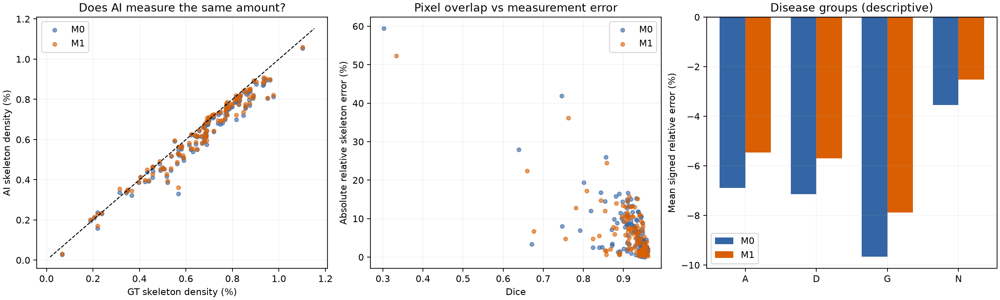

# 血管测量可靠性：60 分钟限时最小测试

日期：2026-09-07。范围：既有 M0/M1 的 118 张开发图，固定阈值 0.5，单种子 seed=2026。本次只读既有预测、标签和记录；新训练 0 次，新推理 0 次，GPU 使用 0 秒，未读取官方 test 图像、标签或预测。

**结论：测量问题值得继续查；M1 有数量测量收益，也有额外结构代价。下一步建议仅做受约束的统一阈值比较。当前不能宣布 M1 是更可靠的测量模型，也不据此启动新训练。**

## 1. 完成情况与时间

- **执行与数据核验：PASS。** 完成全部 118 对、236 份预测，无样本排除，无缺失对。
- 主测试流程从本轮开始计时累计 **430.06 秒，即 7.17 分钟**；数据计算及首轮统计记录为 **81.11 秒**。后续只做 CSV 算术交叉核对、图表检查及本报告整理。
- 用户上限为 3600 秒；预先设定数据软截止为开始后 3000 秒、进程硬截止为 3480 秒，保留交付余量。监督进程正常结束，无超时，无重启预算。
- 核验 2 份检查点哈希、236 份概率图哈希、118 份原始标签及 118 份 FOV 哈希。使用与归档相同的 118 图协议，训练/开发键无交集，开发集均为当前单例非空资格。
- 复算 Dice、Precision、Recall 与每图历史记录的最大差异为 **0**；clDice 也在 1e-12 容差内复现。另与发布版 `images.csv` 逐图核对 Dice、Precision，并从原始计数独立复算 CSV 内的主要误差和面积恒等式，均通过。
- 10 项基础合成检查通过：水平线、斜线、完全一致、断点、额外孤立枝、空参考、空预测、增粗面积、FOV 裁切、空 FOV 拒绝。这只验证基础测量语义，不能代替完整图结构验证或独立人工验收。

## 2. 到底量错多少？

主要测量为固定 FOV 内 Zhang 骨架像素数 / FOV 像素数。主要误差是每图预测相对标签的绝对相对误差，再作图像宏平均；不是物理长度、真实微血管密度或灌注。

| 指标 | M0 | M1 | 解读 |
|---|---:|---:|---|
| **主要误差 MARE_S** | **7.382%** | **6.416%** | 相对下降 13.09% |
| 主要误差图像级 95% 区间 | 6.106%–8.902% | 5.253%–7.823% | 单种子、当前开发图条件下的区间 |
| 带符号骨架相对误差 | −6.807% | −5.382% | 两者总体都低估，M1 减轻低估 |
| 主要误差中位数 | 5.149% | 4.607% | 中间水平也改善 |
| 主要误差第 90 百分位 | 14.640% | 13.145% | 尾部误差仍存在 |
| 面积密度绝对误差，FOV 百分点 | 0.3904 | 0.3617 | 数量改善没有伴随总体面积误差恶化 |
| Dice | 0.908480 | 0.910453 | 与已接受的开发比较相容 |
| Precision | 0.924075 | 0.920107 | 预测纯度下降 |

M1−M0 的主要误差配对差为 **−0.966 个百分点**，图像配对 bootstrap 95% 区间 **[−1.250, −0.677] 个百分点**。118 图中 **101 图改善、17 图恶化**。区间使用 5000 次图像重采样，主分析随机种子 20260907。

去掉任意单张图后，M0 的 MARE_S 范围仍为 **6.937%–7.445%**，问题并非只由最差一张图造成。预定的 M0 Dice ≥0.90 子集包含 91 图，M0 误差仍为 **5.654%**，M1 在同一子集为 **4.873%**。因此，本地已有证据说明较高像素重叠并不保证这个数量代理的误差很小；不推广为所有模型或所有形态指标失效。

## 3. M1 是否只是让数量更接近？

| 空间保护指标 | M0 | M1 | M1−M0 |
|---|---:|---:|---:|
| 标签骨架未获预测掩膜支持比例，1 像素容差 | 10.245% | 9.429% | −0.816 个百分点 |
| 预测额外骨架 / 标签骨架数，1 像素容差 | 5.270% | 5.965% | +0.695 个百分点 |
| FP / FOV | 0.6068% | 0.6468% | +0.0400 个百分点 |

“额外骨架”指预测骨架中距离标签掩膜超过指定容差的像素；这里用标签骨架总数作分母，**不是预测骨架的假阳性率**。两种空间指标不是主要数量误差的精确加法分解，也不验证真假解剖连接。

M1 的漏检减少与额外骨架增加同时出现；上述变化在预定 **0、1、2 像素**容差下方向一致。1 像素容差下，漏检变化的配对区间为 [−0.991, −0.671] 个百分点；额外骨架变化为 [+0.532, +0.872] 个百分点。

补充 CSV 配对核对：Precision 下降 **0.397 个百分点**，双侧 95% 区间 **[−0.530, −0.272] 个百分点**。该区间越过报告提议的 −0.5 个百分点边界，不能按这个区间口径宣布非劣通过；本次也没有执行正式非劣检验。FP/FOV 增量区间为 [+0.0302, +0.0492] 个百分点。补充区间随机种子 20260908，5000 次图像配对重采样。

**判读：M1 有可测到的收益，但代价明确。不能把总数更准直接写成结构更可信。** 本次没有测物理管径或做同管段宽度匹配，不能断言 M1 的改变量全部来自找回细支，也不能断言全部来自增粗。

## 4. 哪些组量得不准？

| 组别 | 图数 | M0 主要误差 | M1 主要误差 | M0 带符号相对误差 | M1 带符号相对误差 |
|---|---:|---:|---:|---:|---:|
| A：AMD | 28 | 6.926% | 5.769% | −6.890% | −5.457% |
| D：糖尿病视网膜病变 | 30 | 8.917% | 8.196% | −7.138% | −5.689% |
| G：青光眼 | 30 | 10.057% | 8.756% | −9.655% | −7.873% |
| N：正常 | 30 | 3.597% | 2.899% | −3.552% | −2.514% |

各组数量误差都下降，但**疾病相对正常组的测量偏移基本未变**。下面使用原始骨架密度差，单位为“骨架密度百分点”，避免用接近零的组间效应作分母：

| 对比 | 标签中的组间差 | M0 中的组间差 | M1 中的组间差 | M0 引入的偏移 | M1 引入的偏移 |
|---|---:|---:|---:|---:|---:|
| A−N | −0.142744 | −0.160155 | −0.160144 | −0.017412 | −0.017400 |
| D−N | −0.220345 | −0.238810 | −0.238928 | −0.018464 | −0.018583 |
| G−N | −0.193275 | −0.214580 | −0.214053 | −0.021305 | −0.020779 |

在当前样本里，模型将标签中的疾病组与正常组差异进一步拉大；没有出现组间方向翻转。M1 虽然改善逐图误差，却没有明显消除这一组间偏移。该表是描述性结果；各对比的未经多重校正区间保存在 `disease_contrasts.csv`，不作疾病因果裁决。

质量混杂很明显：IC/Blur/LC 均为好的图，A 为 23/28、D 为 20/30、G 为 14/30、N 为 29/30。正常组仅 1 张存在任一质量问题；若按具体质量组合分层，多数单元格很小或为空。

例如 Blur=0 的 17 图，M0/M1 误差为 **13.828%/12.115%**；Blur=1 的 101 图为 **6.297%/5.456%**。这支持继续检查质量相关问题，但疾病、质量和参考结构互相关联，不能说已经分清谁造成误差。LC=0 只有 5 图，不支持稳定的该亚组结论。

本次没有计算训练参考均值标准化偏差，也没有做质量调整回归，因此**不宣称完整通过 RQ2 的启动门槛**。

## 5. 研究裁决与下一步

| 层次 | 裁决 | 依据 |
|---|---|---|
| 最小测试执行 | **PASS** | 118 对完成，输入哈希和像素复算通过，低于时间预算 |
| 是否值得继续查测量问题 | **GO，仅建议进入阈值控制** | M0 点估计 7.382%，95% 下限 6.106%，超过报告拟议的 5%/3% 技术触发规则；不是临床严重程度标准 |
| 是否采纳 M1 为更可靠测量方法 | **HOLD** | 数量误差改善，但额外骨架增加，Precision 区间跨过拟议边界，疾病组偏移基本未消除 |
| 是否启动新损失/C1 训练 | **不启动** | 尚未排除统一阈值即可改善的解释，也未完成机制和保护验证 |

建议下一次只比较固定 0.5、Dice 导向、受误检约束的测量导向统一阈值。预先固定候选阈值和开发内选择/留出规则，始终保留官方 test。只有简单选择不足时，才讨论一个针对性训练改动。

这是限时最小实验，不是完整 `morphology_discovery_v1` 验收。本次未做：阈值搜索、图像扰动、新种子、外部数据、加权图长度、ICC、路径身份/误桥、专家复标、患者级独立验证。图像 bootstrap 无法消除未知同患者相关性，也不估计未来训练随机性。所有测量收益限于当前公开标签相对的数字代理，不证明临床诊断或患者结局改善。

## 6. 交付文件

- `protocol.json`：新测量前写入的最小协议、时间截止、版本与范围。
- `provenance.json`、`verification.json`：输入哈希、检查点来源与逐图复算核验。
- `synthetic_checks.json`、`arithmetic_crosscheck.json`：基础语义检查、CSV 算术复核及空间容差结果。
- `per_image_measurements.csv`：236 行原始测量与误差；`paired_errors.csv`：118 行配对变化。
- `subgroup_counts.csv`、`disease_contrasts.csv`：疾病×质量分母及组间测量偏移。
- `summary.json`：总体、疾病、质量、高 Dice 子集、区间和条件性裁决。
- `overview.png`：测量一致性、Dice—测量误差和疾病组低估概览。
- `budget.json`、`run.log`：已结束的运行状态与时间；`run_minimal.py`：本次可审计实现，含绝对截止和禁止静默重启。

