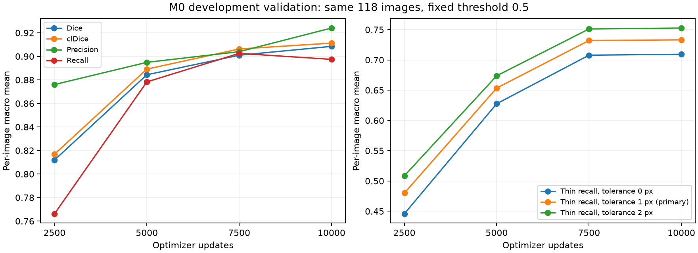

# M0 续训至 10,000 步：开发验证结果

2026-09-06。按授权从 2,500 步继续到 10,000 步，共新增 7,500 次优化器更新。沿用原票据、种子、数据、有效 batch 4 和 10,000 步余弦学习率轨迹；本次没有采集或记录温度。

在 5,000 / 7,500 / 10,000 步暂停训练并验证相同的 118 张开发图像，固定阈值 0.5。各检查点均独立打包并由单一进度登记表接受。未使用官方测试集，也未启动 M1。

| 指标 | 2,500 | 5,000 | 7,500 | 10,000 | 相对 2,500 的变化（百分点） |
|---|---:|---:|---:|---:|---:|
| Dice | 0.8119 | 0.8844 | 0.9010 | 0.9085 | +9.66 |
| Precision | 0.8760 | 0.8949 | 0.9040 | 0.9241 | +4.80 |
| Recall | 0.7662 | 0.8783 | 0.9025 | 0.8975 | +13.13 |
| clDice | 0.8169 | 0.8891 | 0.9063 | 0.9113 | +9.44 |
| AP | 0.8929 | 0.9451 | 0.9549 | 0.9592 | +6.63 |
| 细血管召回（1 px） | 0.4800 | 0.6536 | 0.7321 | 0.7331 | +25.31 |

| 疾病组 | 图像数 | Dice：2,500 → 10,000 | 细血管召回：2,500 → 10,000 |
|---|---:|---:|---:|
| A | 28 | 0.8147 → 0.9144 | 0.4759 → 0.7152 |
| D | 30 | 0.7813 → 0.8892 | 0.4395 → 0.6845 |
| G | 30 | 0.7735 → 0.8868 | 0.4202 → 0.7043 |
| N | 30 | 0.8782 → 0.9439 | 0.5842 → 0.8275 |

本次训练 32.53 分钟；三次验证合计 8.95 分钟；窗口总耗时 43.11 分钟。训练与验证合计约 0.691 个 RTX 5080 占机小时。

资源采样峰值：程序常驻 RAM 3.32 GB，私有提交量 8.83 GB；CUDA 保留显存 3.58 GB，整卡显存 6.74 GB（包含其他应用）。所有记录均低于 12 GB 限制；采样峰值不是连续监测的绝对峰值。

完整性核验通过：优化器实际更新 10,000 次，消费 40,000 个裁块；原 2,500 步历史和前 10,000 个裁块签名未改动；全部采样次序与学习率记录匹配计划；恢复边界的 7 个样本指纹独立重算一致。没有重新计算全部 40,000 个输入指纹，也没有重跑一条完整连续轨迹来证明本次逐位等价。

5,000 步进度登记曾遇到一次 Windows 文件夹移动权限错误；独立重试后成功接收原检查点，没有重跑或丢弃训练更新。中断记录与恢复计划均保留。第一段训练耗时从资源监测器的持续时间恢复，其余两段按父进程计时；窗口总耗时包含登记修复等待。

结果属于单种子的开发学习曲线，不是最终测试成绩或统计显著性证据；不能据此认定某个步数最优。M0/M1 的正式训练预算仍需在开发比较后决定。

最终检查点 SHA-256：`8bce5b8f47c7fe43d553d4467adc46f5387eade014265b7a6a6f4b5211e67d79`。

